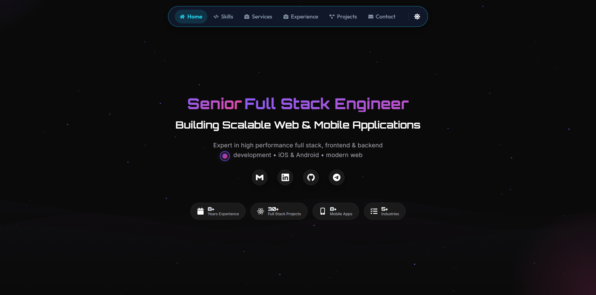
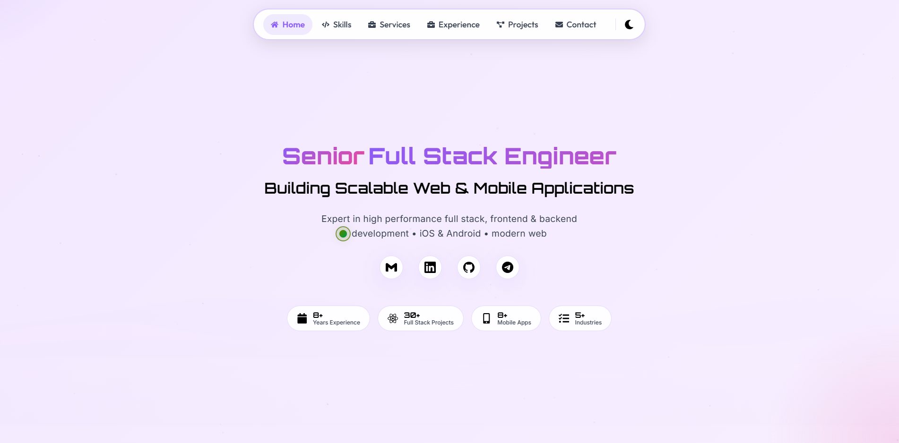
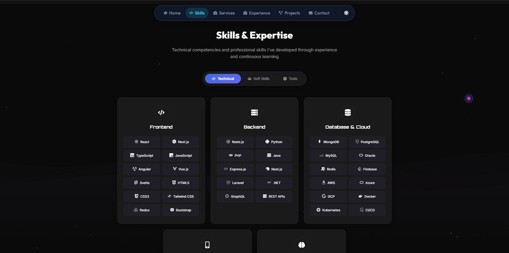
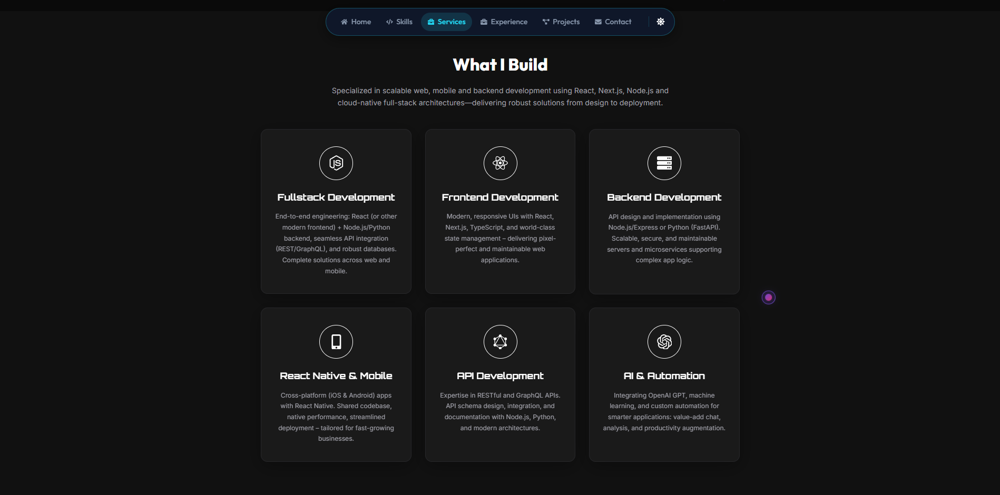
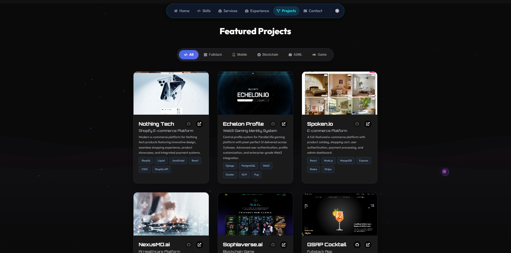

# Developer portfolio — React & Vite

[](https://react.dev/)
[](https://vitejs.dev/)
[](https://www.framer.com/motion/)

Senior **full stack** portfolio with **`src/data/site.json`** (contact, hero, SEO) and **`src/data/projects.json`** (featured work). Runtime SEO in **`src/components/Seo.jsx`**, theme toggle, Framer Motion. Nav uses a **compact pill on the home section** only (`navigation--home`).

---

## Preview

<p align="center"><br /><sub>Dark theme</sub></p>

<p align="center"><br /><sub>Light theme</sub></p>

<p align="center"><br /><sub>Skills</sub></p>

<p align="center"><br /><sub>Services</sub></p>

<p align="center"><br /><sub>Featured projects</sub></p>

PNGs live in **`docs/readme/`** (README only). **`public/robots.txt`** ships with the app.

---

## If this helped you

A **star** is appreciated. ⭐ ✨ 🙏

---

## Features

- Central **`site.json`**: links, hero roles/tagline, `seo` (title, description, keywords, OG image), optional `siteUrl` for canonical + `og:url`
- **`projects.json`** + **`src/assets/`** screenshots via **`projectImages.js`**
- **`Seo.jsx`**: meta tags + JSON-LD `Person`
- **`index.html`**: baseline `<head>` (keep aligned with `site.json`)
- **`browserLogger.js`**: Consola for contact form logs in DevTools
- **Navigation**: smaller nav bar while **`#home`** is the active scroll section

---

## Tech stack

| Layer | Choice |
| --- | --- |
| UI | React 18 |
| Build | Vite 5 |
| Motion | Framer Motion |
| Icons | react-icons |
| Logs | Consola (`consola/browser`) |

---

## Quick start

```bash
npm install
npm run dev
```

```bash
npm run build
npm run preview
npm run lint
```

---

## Configuration

### `src/data/site.json`

| Field | Role |
| --- | --- |
| `siteUrl` | Production URL → canonical + `og:url` when set |
| `person` | Name & copyright |
| `contact` | `email`, `linkedin`, `github`, `telegram` (`""` hides Telegram in hero/footer) |
| `hero` | `roles`, `tagline`, `description` |
| `seo` | `title`, `description`, `keywords[]`, `author`, `ogImage`, Twitter, `jobTitle` |

### `src/data/projects.json`

Per project: `title`, `subtitle`, `description`, `technologies`, `categories` (`Fullstack` \| `Mobile` \| `Blockchain` \| `AI/ML` \| `Game`), `image` (filename in **`src/assets/`**), plus optional `liveLink`, `websiteLink`, `githubLink`, store links.

---

## After deploy

1. Set **`siteUrl`** in **`site.json`**
2. Optional: `sitemap.xml` in **`public/`** and list it in **`robots.txt`**

---

## Repo layout

```
src/data/site.json
src/data/projects.json
src/components/Seo.jsx
src/utils/projectImages.js
src/utils/browserLogger.js
public/robots.txt
docs/readme/*.png
```

---

## Deployment

Build → **`dist/`** → Vercel, Netlify, GitHub Pages, etc. For GitHub Pages subpaths, set Vite **`base`**.

---

## Troubleshooting

If Rollup optional native binary fails on Windows: reinstall Node for your CPU arch, or clean **`node_modules`** + lockfile and **`npm install`**.

---

## License

Personal / learning use.
